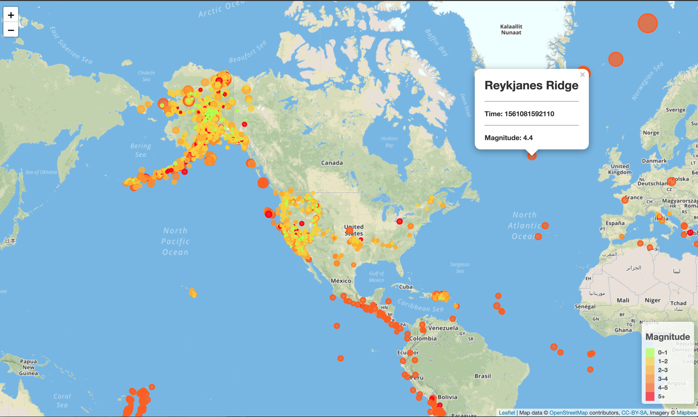

# geo_mapping

Use Leaflet, JavaScript and geoJSON file to visualize earthquakes in USA on map.

Plotted markers for where earthquake has occured. Each marker varying in radius and color depending on earthquake magnitude.

When a marker is clicked, a popup appears showing additional information about the earthquake. 

Data source: http://earthquake.usgs.gov/earthquakes/feed/v1.0/geojson.php

Screenshot:
